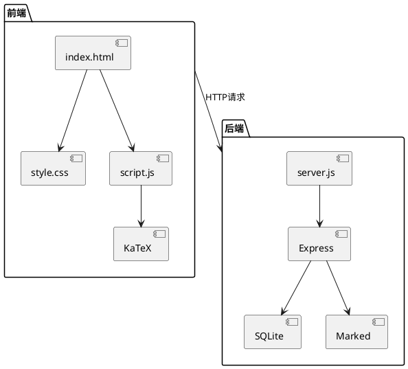
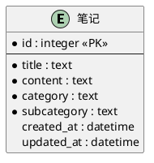

# 物理课程笔记管理系统

## 项目概述
这是一个用于管理物理和数学课程笔记的Web应用系统，采用Node.js + Express + SQLite技术栈开发。

## 依赖安装
```bash
# 安装项目依赖
npm install

# 开发模式安装（包含nodemon）
npm install --include=dev
```

## 运行方法
```bash
# 开发模式运行
npm run dev

# 生产模式运行
npm start
```

## 文件结构
```
project_template/
├── notes/                  # 笔记内容目录
│   ├── 数学/               # 数学分类
│   │   ├── 代数/           # 代数子分类
│   │   └── 几何/           # 几何子分类
│   └── 物理/               # 物理分类
│       ├── 量子力学/       # 量子力学子分类
│       └── 理论力学/       # 理论力学子分类
├── index.html              # 前端主页面
├── style.css               # 全局样式
├── script.js               # 前端逻辑
├── server.js               # 后端服务
├── notes.db                # SQLite数据库
├── site_data.json          # 站点元数据
└── package.json            # 项目配置
```

## 系统架构图


## 数据库ER图


## 元数据说明
站点元数据存储在`site_data.json`中，包含：
- 站点标题
- 分类结构
  - 物理
    - 量子力学
    - 理论力学
  - 数学
    - 代数
    - 几何

## 站点数据结构
```json
{
  "title": "物理课程笔记",
  "categories": [
    {
      "name": "物理",
      "subcategories": [
        {"name": "量子力学"},
        {"name": "理论力学"}
      ]
    },
    {
      "name": "数学", 
      "subcategories": [
        {"name": "代数"},
        {"name": "几何"}
      ]
    }
  ]
}
