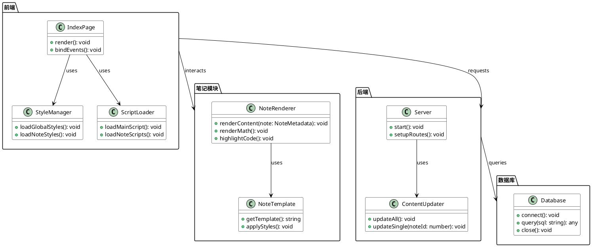
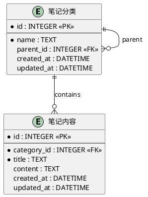

# 物理课程笔记管理系统

## 项目概述
这是一个专门用于管理物理课程笔记的本地Web应用程序，采用模块化设计，支持多级分类管理。系统包含完整的笔记展示、分类管理和本地开发环境。

## 元数据结构

```typescript
interface NoteMetadata {
  id: number;
  title: string;
  category: string;
  tags: string[];
  created_at: Date;
  updated_at: Date;
  content: string;
  references?: string[];
  equations?: string[];
  code_snippets?: CodeSnippet[];
}

interface CodeSnippet {
  language: string;
  code: string;
  description?: string;
}

interface Category {
  id: number;
  name: string;
  parent_id?: number;
  children: Category[];
}
```

## 系统架构



## 数据库ER图



## 文件结构
```
.
├── index.html                # 主页面
├── server.js                 # 本地开发服务器
├── site_data.json            # 站点数据配置文件
├── style.css                 # 全局样式
├── script.js                 # 主脚本文件
├── notes.db                  # SQLite数据库文件
├── update_all_contents.js    # 内容更新脚本
├── notes/                    # 笔记目录
│   ├── contents_template.html # 笔记内容模板
│   ├── style1.css            # 笔记内容样式
│   ├── subscript.js          # 笔记脚本
│   ├── 流体力学/             # 流体力学分类
│   │   ├── 计算流体/         # 子分类
│   │   │   └── contents.html # 具体笔记
│   │   └── ...               # 其他流体力学子分类
│   ├── 数学/                 # 数学分类
│   └── 物理/                 # 物理分类
└── README.md                 # 项目说明文档
```

## 技术栈
- 前端：HTML5, CSS3, JavaScript
- 后端：Node.js, Express.js
- 数据库：SQLite
- 工具：PlantUML（架构图/ER图）
- 依赖库：
  - KaTeX：数学公式渲染
  - Highlight.js：代码高亮
  - Font Awesome：图标显示

## 主要功能
1. 笔记分类管理
   - 支持多级分类
   - 动态生成导航菜单
   - 快速切换不同分类

2. 笔记内容展示
   - 支持Markdown格式
   - 数学公式渲染
   - 代码高亮显示
   - 响应式布局

3. 本地开发环境
   - 实时预览
   - 自动刷新
   - 热重载支持

4. 内容更新
   - 批量更新脚本
   - 自动生成目录结构
   - 内容版本控制

## 使用说明
1. 安装依赖：
   ```bash
   npm install
   ```
   
   项目依赖说明：
   - express@^4.18.2：Web服务器框架
   - marked@^5.1.1：Markdown解析器
   - sqlite3@^5.1.6：SQLite数据库驱动
   - nodemon@^3.0.2：开发服务器热重载工具（开发依赖）

   Windows静默安装命令：
   ```bash
   npm install --silent express@^4.18.2 marked@^5.1.1 sqlite3@^5.1.6; npm install --silent -D nodemon@^3.0.2
   ```

2. 启动开发服务器：
   ```bash
   npm start
   ```

3. 访问应用：
   ```
   http://localhost:3000
   ```

4. 更新内容：
   ```bash
   node update_all_contents.js
   ```

5. 生成架构图/ER图：
   ```bash
   npm run diagram
   ```

## 数据库说明
- 使用SQLite作为本地数据库
- 数据库文件：notes.db
- 包含两个主要表：
  - 笔记分类表：存储分类信息
  - 笔记内容表：存储具体笔记内容

## 贡献指南
欢迎提交Pull Request，请遵循以下规范：
- 保持代码风格一致
- 添加必要的注释
- 更新相关文档
- 确保向后兼容性
