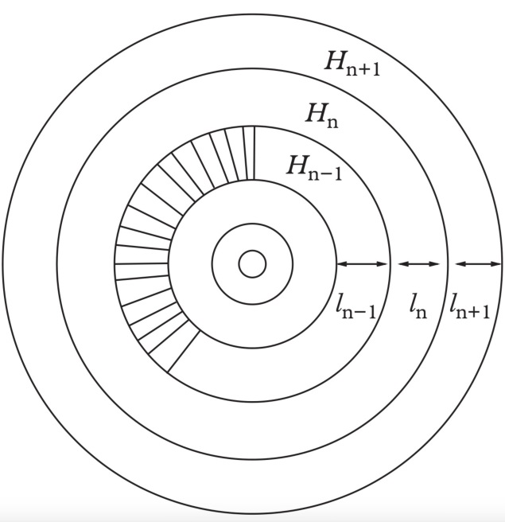
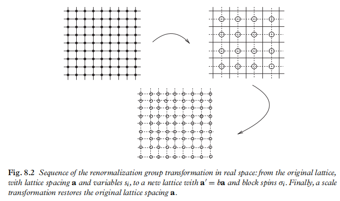
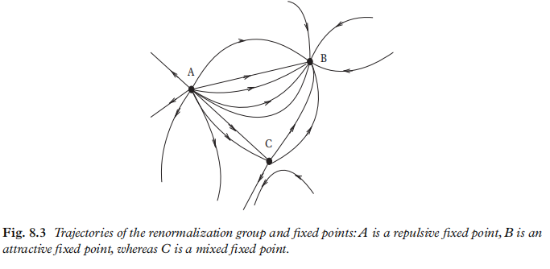
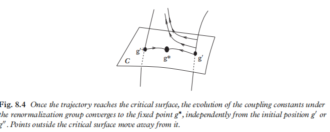
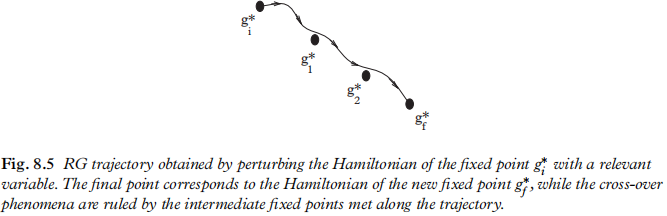
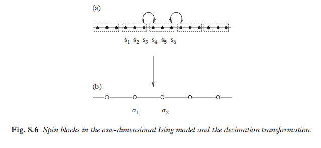
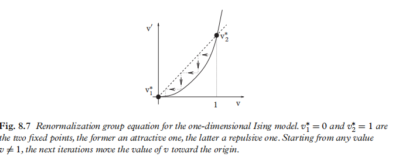
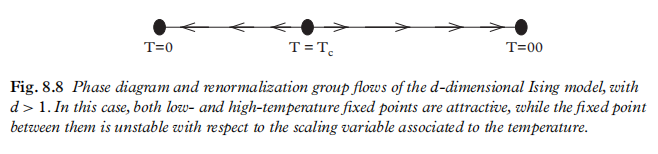

# 漫谈重整化群

## 0. 引言

在临界点，关联长度 $\xi$ 是发散的： 统计涨落（fluctuation）在各个尺度上都互相关联，它们就像大齿轮套着小齿轮一样彼此互相影响。因此，一个临界点处的物理，就如同自发形成了有序的奇观。正如多个齿轮共同工作，可以形成功能复杂的机械一样。在临界点处，也会形成不同于临界点外的物理。而如何瞥见这个临界点处的物理的美妙，使用的物理方法就是重整化群。

在临界点处，通过观察局部的有限多个自由度的动力学来获得物理量的动力学，比如通过微分算子，微分方程等办法来求解临界点处的动力学，是完全失败的。因为这时候涉及到的是全场的整体联动的动力学。关联长度$\xi$无穷大， 正是临界现象的体现。它意味着局部分析的办法完全失效。系统中每一个点的动力学，都和很远很远的地方的另一个点的动力学相关。而这，正是微分方程所无法体现的真实物理。

在重整化群方法出来之前，如果我们考虑的模型，是一个缺乏精确解的模型。那么理解、计算临界指数，就只能通过数值方法或者蒙特卡洛模拟。

但是这种缺乏方法论指导的状况到了 Kenneth Wilson 横空出世的时候被彻底改观了。

对于临界点处的物理，Wilson 发展了一套通用的解决方法，也就是大名鼎鼎的重整化群（RG）理论。除了实际应用之外，RG理论为直面临界现象以及理解背后的普适规律和标度律提供了理论框架。

关于RG的一些概念误区：1. 重整化群不是数学上的群，因为通常来说，RG是不可逆的。2. RG理论并不是专为解决微扰场论的发散行为而设计的。RG本身的应用范围更加宽泛。

**==什么是RG理论的最本质的想法？==**
$$
\boxed{\text{系统耦合强度的变化}}\quad{\Large \Leftrightarrow}\quad \boxed{\text{系统尺度的变化}}
$$
所以，RG可以有一个神秘主义味道很强的通俗说法：强度-尺度对偶。

我们用一个假想的例子来说明这个核心想法。

考虑一个磁系统的涨落。如果我们考虑的是在尺度为  1000 Å  （大概1千个原子）的涨落，那么我们只需要抓住那些与这个尺度接近的涨落就可以了，可以合理地假设只需考虑波长 $L$ 在 800 Å 到 1200 Å 范围内的涨落模式（自由度）即可。而那些与这个尺度相去甚远的涨落模式，不应该对这个尺度下的物理有显著的影响，比如只包含几个原子的涨落，不应该影响一千个原子尺度的涨落。如果这个想法是正确的，那么可以说，物理系统存在一种壳层结构：1-2  个原子的涨落模式，只能影响到 2-4 个原子的涨落模式，然后2-4 个原子的涨落模式，继续影响下一个层级（4-8）个原子的涨落模式。那么，我们可以按照这个层级来构建每个层级的理论。在每个层级都构造一个有效的哈密顿量来描述这个层级下发生的故事。比如，像下图这样。

RG其实回答了这样的问题：从一个层级的物理，下一个层级的物理（故事），应该如何“转场”呢？比如，1. 如果系统中没有尺度相关的物理，那么这样的系统就是一个标度不变的系统，可以用一个简单的哈密顿量来统一描述所有层级的物理，而各个层级之间的转换只是简单的重新标度变换。如果系统存在特征尺度，比如和晶格间距相关的涨落，它们就没有标度不变性，那么不同尺度之间的“转场”就需要用一个函数或者方程来描述了。RG方程就是描述这样的“转场”的控制方程。2. 物理系统中的级联现象，往往存在所谓的放大效应或者缩小效应。其中放大效应对应的是在某个特征尺度发生相变现象。而缩小效应则对应的是普适律，比如在微观层面非常不同的原子晶格，在宏观层面却表现出来完全一致的物理性质。

首先来看放大效应。在临界温度以上，在某个小尺度 $\xi_0$，温度的小变化对这个尺度的物理影响极小。因为关联尺度定格在这个小尺度上。但在某个临界温度 $T_c$ , 关联长度的发散性出现了。这种大尺度的关联行为，会使得热效应或者噪声效应被完全压制，这就会出现系统表现出非常不同的行为。换言之：在临界温度 $T_c$，一个精密构造的齿轮结构形成了！

然后我们来看缩小效应。比如六角蜂窝格子的 Ising 模型，和三角格子的 Ising 模型，虽然晶格完全不同，但它们的相变点处的配分函数，关联函数在形式上是完全一样的。这说明它们在相变点具有完全相同的物理。正所谓：大道三千，殊途同归！

下面来讲一下**RG理论的两个不同研究方向**。

1. **高能物理和场论**：由于高能物理和场论讨论的是动量空间里的积分（比如关联函数），关联函数的发散使得场论学家们不得不考虑截断物理能标，从而考虑一个在这个截断能标下有效的场论。这里面就涉及到各种正规化方法，目的都是为了消除发散。但是这样就面临一个问题，不同的截断能标，对应的物理应该是怎样变化的？这恰恰就是RG理论框架所能处理的问题。所谓截断能标，其实就是一个动量空间的“尺度”，随着这个截断能标的变化，理论的耦合常数如何变化，这正是一个重整化群问题！
2. **实空间重整化**：通常考虑的是格点理论。改变格点的格子距离，就是一个尺度变化问题。这恰好是问尺度变化时，耦合强度如何变化的问题。

RG 理论中的一个关键概念：**耦合的相关性**。

RG本质上是考虑尺度的变化，那么尺度变化时，耦合强度是如何变化呢？有两种方式，一种是**相关耦合**。如果耦合强度随着尺度变化是同步变化（尺度小变大 $\Leftrightarrow$ 耦合弱变强）。另一种是**无关耦合**，随着尺度变大，耦合越来越小，这就叫无关耦合。

#### **临界现象：自相似，长程相关，幂律**

Ising 模型，在不同温度的典型情况：

左边，是温度很低，很固定，很无聊。

右边，是温度很高，很混乱，很无聊。

有趣的是中间的相变温度 $T_c$，此时系统在秩序与混沌之间的临界状态，自相似的状态。

## 1. 减少自由度

让我们考虑一个**定义在 $d$ 维规则晶格上的统计系统，晶格间距为 $a$，其自由度 $s_i$ 位于晶格顶点上。**设 $H(\{s_i\}, g_k)$ 为系统的哈密顿量，其中 $g_k$ 是各种相互作用的耦合常数。

 $s_i$ 是伊辛变量，哈密顿量 $H$ 可以写为 $H = H^{(+)} + H^{(-)}$，其中 $\pm$ 符号分别对应于 $Z_2$ 交换对称性的偶奇部分。偶部的最一般的哈密顿量：
$$
H^{(+)}(\{s_i\}, g_k) = \sum_{i,j} g_{ij}^{(2)} s_i s_j + \sum_{i,j,k,l} g_{ijkl}^{(4)} s_i s_j s_k s_l + \cdots \tag{1.1}
$$

奇部分的最一般的哈密顿量：

$$
H^{(-)}(\{s_i\}, g_k) = \sum_i g_i^{(1)} s_i + \sum_{i,j,k} g_{ijk}^{(3)} s_i s_j s_k + \cdots \tag{1.2}
$$

注意：在上述公式中，指标不一定限制在最近邻。配分函数由以下公式给出：

$$
Z(\{g_k\}) = \sum_{\{s_i\}} \exp[-H(\{s_i\}, g_k)]，\tag{1.3}
$$

其中我们在哈密顿量的耦合常数 $g_k$ 定义中包含了因子 $\beta = 1/KT$。在给定 $g_k$ 值的情况下，**系统的相关长度 $\xi(g_k)$ 是耦合的函数**。这个量**度量了有效耦合在一起的自由度的数量**。**可以预期，$\xi(g_k)$ 越小，微扰论的有效性和精确性越高**（这就是说，如果耦合相干长度小，就意味着相互作用能影响的范围很短，这当然微扰论非常有效。）。

别忘了我们的使命是：**==寻找一个尺度变换 $a \rightarrow ba$，在相关长度 $\xi$ 和相关长度 $\xi' = \xi/b < \xi$ 的系统之间建立对应关系。==**

 **为什么要建立这样的对应关系呢？**假如考虑的初始系统的动力学极其复杂，我们无法承受这种计算的复杂度，千丝万缕，无从下手。但是如果存在这种尺度变换的对应关系，那么我们可以在另一个尺度下考虑更简单的系统。这个更简单的系统可能是一个可解模型，或者至少是更简单的模型。这就是重整化群的真正意义所在。那么为什么有可能存在一个更简单的系统呢？实际上，在尺度变换时，有些耦合是相关耦合，有些耦合是无关耦合。那意味着总是可以通过尺度变换，剔除掉那些无关耦合，这样的系统当然会大大简化。

*==话归正传==。*

所谓耦合相关长度 $\xi$ ，实际上说的是：**在半径为 $\xi$ 的球体内的自旋彼此相关**。那些在直径$ba \,(b>1)$球壳内的自旋，即 $a \ll ba \ll \xi$ 的的自旋，表现得像一个单元。我们可以想象对初始系统进行缩放，重新组织自旋块中的自旋为新的变量。这个过程如同卷积一样！

**我们具体实现一下这个想法。**

让我们将原始晶格划分为块，记为 $B_k$，每个块由 $b^d$ 个自旋组成。如果 $N$ 是座位（sites）的总数，则有 $N \over b^{d}$ 个块。完成这种划分后，将每个块中自旋 $s_i$ 按采样规律（即卷积），为每个块分配一个新变量 $\sigma_i^{(1)}$，其中 $i \in B_k$：
$$
\sigma_i^{(1)} = f(\{s_i\})，\quad \text{con } i \in B_k \tag{1.4}
$$

我们稍后再讨论采样规律（卷积）的性质。目前让我们聚焦这种变换的效果。也就是将模型更改为一个新的模型，该模型定义在新晶格上，新的晶格间距为 $a' = ba$。**在所有动力学变量根据变换 (1.4) 发生变化后，随后将新晶格按因子 $b^{-1}$ 缩放（不改变自旋），以便我们回到与原始晶格相同的晶格。**我们上面描述的内容是实空间 RG 的实现，因此它由一系列变换的迭代组成：

$$
\sigma_k^{(n+1)} = f(\{\sigma_i^{(n)}\})，\quad \text{with } i \in B_k \tag{1.5}
$$

其中 $\sigma_i^{(n)}$ 表示此过程的第 $n$ 步的自旋变量。

这种变换的一个重要方面是其局部性质：定义变量 $\sigma_k^{(n+1)}$ 仅涉及变量 $\sigma_i^{(n)}$，而不涉及原始自旋 $s_i$。请注意，**在过程的每一步中，我们在因子 $b$ 的尺度上失去了关于自旋波动的信息。** 这就是说，逐步将理论从紫外（距离极小）推到红外（距离很大）。

## 2. 采样法则和有效哈密顿量

有几种合理的采样法则选择 $f(\{\sigma_i\})$ 用于更新自旋变量，每种选择都会导致不同的 RG 粗粒化。然而，应该意识到，**==真正重要的是所采用迭代过程的渐近行为。在极限 $n \to \infty$ 中，变换法则之间的差异可能会消失，导致相同的物理场景==。**在 RG 的实空间版本中，最常用的两种版本如下：

- **==抽取法==**。此法则将块 $B_k$ 的自旋 $\sigma_k^{(n+1)}$ 赋值为其中一个自旋 $\sigma_i^{(n)}$ 的值，例如中心的一个（**类似神经网络CNN的中心Pooling**）
  $$
  \sigma_k^{(n+1)} = \sigma_j^{(n)}，\quad j \in B_k
  $$

- **==多数规则==**。此法则将块 $B_k$ 的自旋 $\sigma_k^{(n+1)}$ 赋值为自旋 $\sigma_i^{(n)}$ 的多数值，即
  $$
  \sigma_k^{(n+1)} = A^{(n)} \sum_{i \in B_k} \sigma_i^{(n)}，
  $$
  **其中 $A^{(n)}$ 是归一化常数**。我们必须小心实施后者的过程，因为它取决于自旋 $\sigma_i$ 的性质。例如，如果它们是取值为 $\pm 1$ 的伊辛变量，选择奇数个自旋的块是方便的，以避免为下一个块自旋生成零值。归一化常数 $A^{(n)}$ 用于重新建立新变量的正确取值范围 $\pm 1$。

注意上述两种变换的不可逆性：**知道 $\sigma_k^{(n+1)}$ 的值实际上不可能追溯生成它的自旋 $\sigma_i^{(n)}$。**

给定一个变换法则，方便引入算子**==（这实际上在神经网络里也有，想一想，它是什么？）==**
$$
T(\sigma_k^{(n+1)}, \sigma_i^{(n)}) = 
\begin{cases} 
1, & \text{if } \sigma_k^{(n+1)} = f(\{\sigma_i^{(n)}\}) \\ 
0, & \text{otherwise} 
\end{cases} \tag{2.1}
$$
它满足
$$
\sum_{\{\sigma_k^{(n+1)}\}} T(\sigma_k^{(n+1)}, \sigma_i^{(n)}) = 1。 \tag{2.2}
$$

**==答案揭晓：激活函数！作用是分配权重（参数）！==**

通过固定自旋的变换法则，我们确定了新块自旋的有效哈密顿量 $H^{(n+1)}(\{\sigma_i^{(n+1)}\}, g_k^{(n+1)})$。由于变换 (1.5) 仅依赖于自旋 $\sigma_i^{(n)}$ 的配置，新哈密顿量将由第 $n$ 步哈密顿量 $H^{(n)}(\{\sigma_i^{(n)}\}, g_k^{(n)})$ 确定。让我们用
$$
P(\{\sigma_i^{(n)}\}) = \exp\left[-H^{(n)}(\{\sigma_i^{(n)}\}, g_k^{(n)})\right]，
$$
表示实现构型 $\{\sigma_i^{(n)}\}$ 的概率（它还有个名字：**==玻尔兹曼因子==**），并**==通过条件概率定义新哈密顿量==**
$$
\underbrace{\exp\left[-H^{(n+1)}(\{\sigma_i^{(n+1)}\}, g_k^{(n+1)})\right]}_{n+1-步的概率} = \sum_{\{\sigma_i^{(n)}\}} \underbrace{\prod_{\text{blocks}} T(\sigma_k^{(n+1)}, \sigma_i^{(n)})}_{激活函数} \underbrace{\exp\left[-H^{(n)}(\{\sigma_i^{(n)}\}, g_i^{(n)})\right]}_{n-步的概率}. \tag{2.3}
$$

换句话说，根据变换法则分配新块自旋 $\sigma_k^{(n+1)}$，对前一步的自旋 $\sigma_i^{(n)}$ 的玻尔兹曼因子进行加权平均，得到新块自旋的玻尔兹曼因子。

**为了避免在迭代过程中引入一些附加常数，固定哈密顿量序列的归一化条件可能是有用的**，例如
$$
\sum_{\{\sigma_i^{(n)}\}} H^{(n)}(\{\sigma_i^{(n)}\}, g_i) = 0。
$$

使用这种归一化（**这相当于要将真空配分函数设为1**，**==想一想，神经网络里面有什么和这个是类似的？==** ），我们有
$$
\sum_{\{\sigma_k^{(n+1)}\}} \exp\left[-H^{(n+1)}(\{\sigma_i^{(n+1)}\}, g_k^{(n+1)})\right] = \sum_{\{\sigma_i^{(n)}\}} \exp\left[-H^{(n)}(\{\sigma_i^{(n)}\}, g_i^{(n)})\right]， \tag{2.4}
$$
以及**==相同的配分函数==**
$$
Z^{(n+1)}(g_k^{(n+1)}) = Z^{(n)}(g_i^{(n)})。 \tag{2.5}
$$

[**答案揭晓：在神经网络里面，这一步相当于取批归一化！**]这种等式也适用于变量 $\sigma_k^{(n+1)}$ 的任何算子 $X$ 的期望值，这与我们使用 $H^{(n+1)}$ 还是 $H^{(n)}$ 计算无关，鉴于恒等式
$$
\begin{align}
\langle X \rangle &= \frac{1}{Z^{(n+1)}} \sum_{\{\sigma_k^{(n+1)}\}} X(\{\sigma_i^{(n+1)}\}) \exp\left[-H^{(n+1)}(\{\sigma_i^{(n+1)}\}, g_k^{(n+1)})\right] \nonumber\\ &= \frac{1}{Z^{(n)}} \sum_{\{\sigma_i^{(n)}\}} X(\{\sigma_i^{(n+1)}\}) \exp\left[-H^{(n)}(\{\sigma_i^{(n)}\}, g_i^{(n)})\right].
\tag{2.6}
\end{align}
$$

这使我们**能够计算期望值而无需指定使用了哪个有效哈密顿量**。

#### **耦合常数的流形**

**为了成功实现 RG 的程序，显然最重要的一步是新有效哈密顿量 $H^{(n+1)}$ 具有与 $H^{(n)}$ 相同的函数形式，以便模型在序列的每一步保持不变，除了其耦合常数的值变化。** **==换言之，每一步的物理动力学都是相似的！不同的仅仅是耦合强度不一样！==**

事实上，如果我们将注意力限制在具有有限多个耦合数的哈密顿量上，这是不可能的。因为每一步都会生成新的耦合：例如，从一个仅限于最近邻自旋之间的哈密顿量开始，新哈密顿量具有一个新的交互作用，涉及到更多的自旋。因此，从与模型对称性和统计变量性质兼容的所有可能耦合常数的系统集合开始才是方便的，这就是为什么要引入耦合常数的流形的理由。

我们用 $\{g^{(n)}\} \equiv (g_1^{(n)}, g_2^{(n)}, \ldots)$ 表示有效哈密顿量 $H^{(n)}$ 的所有耦合。在这样的流形中，方程 (2.3) ，即每一步的配分函数等价，可以解释为耦合常数 $\{g\}$ 的动力学运动。这种运动在离散时间步长中进行，并由以下方程控制
$$
\{g^{(n+1)}\} = \mathcal{R}(\{g^{(n)}\})， \text{ {\bf : 耦合常数的动力学控制方程}} \tag{2.7}
$$
**其中 $\mathcal{R}$ 通常是一个复杂的非线性变换**。从点 $\{g^{(0)}\}$ 开始并应用 (2.7)，系统的点在序列 $\{g^{(0)}\}, \{g^{(1)}\}, \{g^{(2)}\}, \ldots$ 中演化，从而以这种方式给出 RG 轨迹（图 8.3）。重要的是要强调轨迹的所有点描述相同的物理情况：它们只是对应于在不同放大镜下观察系统。

在变换 (2.7) 下，相关长度必须相对于新的晶格间距进行测量，因此它变化为

$$
\xi(g^{(n+1)}) = b^{-1} \xi(g^{(n)})。 \tag{2.8}
$$

因此，在每一步过程中，它缩小了一个因子 $b$。这是因为，耦合相干长度绝对值是保持不变的，但是相对长度会随着晶格间距变大而变小。

## 3. 不动点

RG 变换的数学性质与动力系统相同，这是物理学和数学的重要课题。先验地，可以预期从耦合常数空间中的点 $P$ 开始的轨迹会有任意行为，伴随振荡、不连续性或锯齿状行为。然而，**在所有具有物理意义的情况下，都观察到耦合常数随着RG变换平滑收敛到某些不动点**。**不动点**是在映射 (2.7) 下保持不变的耦合常数流形中的点

$$
g^* = \mathcal{R}(g^*)。 \tag{3.1}
$$

**==在不动点，相关长度要么发散，要么消失==**，如从方程 (2.8) 在 $g = g^*$ 处评估时可以很容易地看出
$$
\xi(g^*) = b^{-1} \xi(g^*)。 \tag{3.2}
$$

#### 不动点的性质

当 $\xi = \infty$ 时的不动点称为临界点，而**当 $\xi = 0$ 时的不动点称为平凡不动点**。不动点可以进一步根据其稳定性性质分类：它们可以是**吸引的、排斥的或混合的**。如果在 $g^*$ 的邻域中，变换 $g^{(n)}$ 的迭代收敛到 $g^*$，我们有一个吸引不动点。如果 RG 变换的迭代从 $g^*$ 附近开始将点移离 $g^*$，则我们有一个排斥不动点。混合不动点在其附近具有两种类型的轨迹。

#### 线性化

不动点的性质可以通过研究变换 (2.7) 的线性版本来确定：设 $g = g^* + \delta g$，我们有

$$
g^* + \delta g' = \mathcal{R}(g^* + \delta g) \simeq \mathcal{R}(g^*) + K \delta g = g^* + K \delta g，
$$

即

$$
\delta g_a' = K_{ab} \delta g_b， \tag{3.3}
$$

其中矩阵 $K_{ab}$ 定义为

$$
K_{ab} = \frac{\partial \mathcal{R}_a}{\partial g_b}。 \tag{3.4}
$$

这个矩阵不一定是对称的，因此有必要区分右特征向量和左特征向量。用 $\lambda^i$ 表示 $K$ 的左特征值，用 $\Delta^i$ 表示 $K$ 的左特征向量 ，我们有

$$
\sum_a \Delta_a^i K_{ab} = \lambda^i \Delta_a^i。 \tag{3.5}
$$

就 $\Delta_a^i$ 而言，让我们定义位移 $\delta g_a$ 的线性组合

$$
u_i \equiv \sum_a \Delta_a^i \delta g_a。 \tag{3.6}
$$

这些线性组合称为**标度变量**。它们具有在 RG 变换下以乘法方式变换的重要性质

$$
u_i' = \sum_a \Delta_a^i \delta g_a' = \sum_{a,b} \Delta_a^i K_{ab} \delta g_b = \sum_b \lambda^i \Delta_b^i \delta g_b = \lambda^i u_i。 \tag{3.7}
$$

如果 $b$ 是块自旋的重新标度参数，通常用 $b^{y_i}$ 来参数化 $\lambda^i$， $y_i$ 被不恰当地称为 RG 的特征值（实际上应该叫**标度权重**）。实际上，它们（b,y）决定了统计模型的临界指数。忽略 $y_i$ 是复数的情况，我们有以下几种情况：

1. $y_i > 0$。在这种情况下，相应的 $u_i$ 是一个**相关变量**。重复标度变换将其值移离临界点。
2. $y_i < 0$。在这种情况下，$u_i$ 是一个**无关变量**。从足够接近不动点开始，迭代进行标度变换，将会使其从初始值缩小到零。
3. $y_i = 0$。在这种情况下，$u_i$ 是一个**边缘变量**。迭代变换时，该变量的值不变。

我们仔细思考一下，**相关变量和无关变量，对应到神经网络深度学习里面是什么？**

回想一下，标度变换实际上对应到神经网络里面就是卷积+池化+激活+批归一化。在这个过程中，**相关变量是在卷积滤波过程中权重增大的特征。而无关变量则是被卷积滤波滤掉的特征**。一个深刻的问题是：是保留下来的特征重要？还是被滤波滤掉的特征重要？乍一看，好像只有能够保留下来的才是重要的特征。但是实际上相关和无关是一个硬币的正反面，这就如同流形中的嵌入定理一样。比如一个球面当然可以用两个正交变量来描述，但更经济更简单的表达是将它嵌入到欧几里得三维空间中，虽然这时候多了个径向冗余变量。而且三维欧几里得空间显然能完全表达二维各种几何形状，但球面只能表达球面。**==实际上，无关变量的作用远远不仅是提供了额外的冗余。它实际上提供了强大的“触类旁通”的生成功能！==**

#### 临界面

我们继续分析耦合常数流形上的重整化群流。假设耦合常数流形的维度为 $m$，让我们考虑一个具有 **$n$ 个相关变量和 $(m-n)$ 个无关变量**的不动点 $g^*$。这意味着存在一个 $(m-n)$ 维的表面 $C$，称为**临界面**，它是吸引到不动点 $g^*$ 的吸引盆。在这个表面上，相关长度是无限的。系统的耦合常数 $g_k$ 通常依赖于系统的外部参数，例如温度、压力或磁场。改变这些外部参数，耦合常数的点 $\{g\}$ 相应变化。当有 $n$ 个相关变量时，为了截取临界面，必须选择适当的 $n$ 个外部控制参数。在所有具有物理意义的情况下，温度是这些参数之一，其值必须调整到其临界值 $T = T_c$ 以达到临界面。这可能还不够：如果有磁场，必须关闭它们，可能还需要适当地调整化学势。一旦对 $n$ 个实验参数进行了微调，点 $\{g\}$ 就在临界面上。如果我们现在应用 RG 变换，它们的迭代将 RG 移动到不动点 $g^*$，独立于其在 $C$ 上的初始位置（图 8.4）。这简而言之就是 RG 的起源。

---

这个简单的分析揭示了临界现象的普遍行为：**==如果两个哈密顿量，它们仅仅在无关算子相互作用上表现不同，而具有相同的相关算子相互作用，那么这两个系统将表现出相同的临界行为。==**

这就像神经网络中识别动物，如果两幅图片中都有猫，但是猫的大小和毛色品种不完全相同，神经网络仍然能够识别它们都是猫。因为大小、毛色、品种并不是决定猫这种动物的决定性因素，也就是说，它们是无关算子。

尽管看起来重整化群和神经网络看起来很像。但实际上，重整化群比神经网络的内涵更丰富。因为它描述的是系统的动力学，而CNN这样的神经网络，描述的是静力学。**==重整化群比神经网络丰富的部件，仅仅是引入了临界面这样的概念。临界面就是将不同的系统根据其动力学而归纳总结的一种共性特征面。==** 就如同哺乳动物这样的一个门类，它涵括了猫，狗，猴，牛，羊等等各种纷繁复杂的动物。所谓纲举目张，不外如是。有了临界面，我们可以逐渐打开各种无关变量，然后就可以“生成”出大千世界！可以说，*==临界面就是具备无穷创造力的母体！==* 

让我们现在证明相关长度在临界面上发散。假设物理系统由耦合常数空间中的点 $\{g\}$ 表示，经过 $n$ 次迭代后，由 $\{g^{(n)}\}$ 表示。使用方程 (8.3.8)，我们有以下恒等式序列

$$
\xi(g) = b \xi(g^{(1)}) = b^2 \xi(g^{(2)}) = \cdots = b^n \xi(g^{(n)})。
$$

如果初始点 $\{g\}$ 在临界面上，则在极限 $n \to \infty$ 中，序列 $\{g^{(n)}\}$ 收敛到 $\{g^*\}$，即 $\lim_{n \to \infty} \{g^{(n)}\} = \{g^*\}$：由于 $\xi(g^*) = \infty$ 且 $b > 1$，我们有 $\xi(g) = \infty$ 对于临界面上的所有点。

**==问题的关键是：如何识别临界面？==**临界面是在RG变换下保持不变的面！这意味着它是RG变换不变的参数空间，也就是RG群的轨道空间。

#### RG 流的性质

问题的物理性质有助于澄清轨迹的几何性质及其某些属性。例如：

- **RG 轨迹不能相交**，因为如果发生这种情况，意味着后续哈密顿量的定义将是模糊的——从物理角度来看，这是不可能的。

- 在哈密顿量中切换一个**相关变量**，该哈密顿量在不动点 $g_i^*$ 处，相关流将系统从该耦合常数点移开。在此运动结束时，点 $\{g\}$ 到达一个平凡不动点（相关长度为零）或另一个临界点 $g_f^*$。显然，**==接近两种最终点都是沿着重整化群流形中的一个耦合无关变量方向==**。

- 在沿 RG 流运动期间，点可能接近其他不动点 $g_a^*$（$a = 1, 2, \ldots$）（图 8.5）。如果轨迹足够接近它们，可能会出现一系列有趣的交叉现象。根据系统的尺度，可能观察到以下行为：（i）在短距离，临界行为由原始不动点 $g_i^*$ 控制；（ii）在中间尺度，标度行为与最近的不动点相联系；（iii）在长距离，标度行为由最终不动点 $g_f^*$ 控制。

**以上就是在空中俯瞰实空间 RG 理论的整个框架，我们落地到真正的模型中。**

---

### 4. 伊辛模型

第一个例子是一维伊辛模型。作为初始哈密顿量，我们采用最近邻相互作用

$$
H(s_i; \mathfrak{J}) = -\mathfrak{J} \sum_i s_i s_{i+1}。 \tag{4.1}
$$

每对自旋具有玻尔兹曼权重(代表相邻自旋之间的耦合)

$$
W(s_i, s_{i+1}; v) = e^{\mathfrak{J} s_i s_{i+1}} =\textcolor{red}{\boxed{e^{-\beta H_{i,i+1}}}} = \cosh \mathfrak{J} (1 + v s_i s_{i+1})，\tag{4.2}
$$

其中 $v = \tanh \mathfrak{J}$。为了应用 RG 变换，我们将系统划分为块，每个块由三个自旋组成，然后应用抽取规则：对于每个块，我们选择新系统的一个自旋，即中心的一个（图 8.6）。

考虑两个相邻块。为了实现 RG 过程，必须对自旋 $s_3$ 和 $s_4$ 求和，同时保持两个块中心自旋的值不变，这里记为 $\sigma_1 \equiv s_2$ 和 $\sigma_2 \equiv s_5$。在分区函数中，涉及两个相邻块自由度的项为

$$
e^{\mathfrak{J} \sigma_1 s_3} e^{\mathfrak{J} s_3 s_4} e^{\mathfrak{J} s_4 \sigma_2}。
$$

使用恒等式 $e^{\mathfrak{J} x_a x_b} = \cosh \mathfrak{J} (1 + v x_a x_b)$ 对前面方程的所有三项，我们有

$$
(\cosh \mathfrak{J})^3 (1 + v \sigma_1 s_3) (1 + v s_3 s_4) (1 + v s_4 \sigma_2)。
$$

展开这个乘积并对$s_3$和$s_4$求和，我们得到

$$
2^2 (\cosh \mathfrak{J})^3 (1 + v^3 \sigma_1 \sigma_2) \propto W'(\sigma_1,\sigma_2;v')
$$

除了一个乘法归一化常数（与自旋无关）外，这个表达式与(4.2)的形式相同，因此它定义了块自旋$\sigma_1$和$\sigma_2$的**==新玻尔兹曼权重==**，其中

$$
v' = v^3。 \tag{4.3}
$$

因此，系统的新哈密顿量由下式给出

$$
H(\sigma_i; \mathfrak{J}') = N' p(\mathfrak{J}) - \mathfrak{J}' \sum_i \sigma_i \sigma_{i+1}， \tag{4.4}
$$

$N$是总自旋数目, $N' = {N\over3}$ 为新的自旋块数目，新耦合常数的值是

$$
v\rightarrow v^3 \equiv v'\Rightarrow \mathfrak{J}'  = \tanh^{-1} \left[ (\tanh \mathfrak{J})^3 \right]， \tag{4.5}
$$

$p(\mathfrak{J})$是来自我们求和的自由度对自由能的贡献，它确保两个系统的配分函数的正确归一化

$$
p(\mathfrak{J}) = - \log \left[ \frac{(\cosh \mathfrak{J})^3}{\cosh \mathfrak{J}'} \right] - 2 \log 2。
$$

可以验证：
$$
\exp(p(\mathfrak{J}))W'(\sigma_1,\sigma_2;v') = \cosh{\mathfrak{J}'} (1+v'\sigma_1\sigma_2)
$$
**==注意：在上面使用RG变换的过程中，要求变换前后的哈密顿量形式上只能相差一个无关的归一化因子，这就是真正能确定临界面的核心方法！==**

现在让我们使用耦合常数的变换法则，方程(4.3)，来研究模型的物理实质。绘制这个映射的图是有用的。很容易看出映射有两个不动点：$v_1^* = 0$和$v_2^* = 1$ (满足 $v^*\equiv v^{*3}$)。第一个是吸引不动点，第二个是排斥不动点(见图8.7)。除非$v$恰好为1，否则每次迭代都会将$v$的值移向0。记住我们在$\mathfrak{J}$中吸收了因子$\beta = 1/kT$。这意味着高温相（$T \to \infty$）对应于$v$接近0的值，而低温相（$T \to 0$）对应于$v \to 1$，即$v = 1$当$T = 0$。

由于每次迭代时有效耦合常数向0移动，大尺度自由度由有效哈密顿量描述，其中温度增加：这是系统处于顺磁相且具有有限相关长度的区域。这适用于所有$v$值（除$v = 1$外），因**==此我们得出结论，一维伊辛模型总是处于无序相。==**这一结论确实得到了该模型精确解的证实。还可以很容易地推导出相关长度如何依赖于耦合常数：只需使用变换法则

$$
\xi(v') = \frac{1}{3} \xi(v)， \tag{4.6}
$$

（记住$b=3$）并用方程(4.3)替换$v'$。因此，相关长度满足函数方程

$$
\xi(v^3) = \frac{1}{3} \xi(v)， \tag{4.7}
$$

其解为

$$
\xi(v) = -\frac{\xi_0}{\log v} = -\frac{\xi_0}{\log \tanh \mathfrak{J}}。 \tag{4.8}
$$

这个表达式与$\xi(v)$的行为一致（在第2章中讨论）。注意$\xi$总是有限的，除非$\mathfrak{J} \to \infty$（$T \to 0$），在这种情况下它发散为$\xi \simeq e^{1/T}$。这进一步证明了一维伊辛模型总是处于顺磁相，除非$T = 0$。

**简单的一维晶格上的 Ising 模型给了我们一些基本的关于RG 工作原理的初步轮廓。**

一般来说，高维晶格上Ising 模型，是没有简单的解析表达式的。但上述论述也有助于理解高维晶格上 Ising 模型的相图。首先，让我们仔细考虑一维情况：如果我们参考两个相邻块的自旋变量，在极限$\mathfrak{J} \to \infty$中，固定新耦合常数的方程可以写为
$$
\mathfrak{J}' \simeq \mathfrak{J}_{\langle s_3 \rangle_{\sigma_1 = 1} \langle s_4 \rangle_{\sigma_2 = 1}}， \tag{4.9}
$$

其中$\langle s_3 \rangle_{\sigma_1 = 1}$是块边缘自旋的平均值，条件是块中间的自旋取值为1。由于这些平均值总是小于1（除了在$\mathfrak{J} = \infty$时），我们有$\mathfrak{J}' < \mathfrak{J}$，因此低温不动点总是不稳定的。

对于$d$维晶格（$d > 1$），情况不同。考虑在极限$\mathfrak{J} \to \infty$中耦合的变换法则。新耦合常数的值基本上由块边界上自旋的期望值决定。由于有$b^{d-1}$个自旋，我们有

$$
\mathfrak{J}' \simeq b^{d-1} y，\quad \mathfrak{J} \to \infty。 \tag{4.10}
$$

对于$d > 1$，我们有$\mathfrak{J}' > \mathfrak{J}$，即低温不动点现在是吸引的！另一方面，很容易说服自己高温不动点也是吸引的。两个不动点的吸引性质意味着伊辛模型在$d > 1$时应该在有限耦合常数值处有一个临界值，即应该存在一个临界温度$T_c$，模型在此处发生相变（见图8.8）。

### 5. 高斯模型

另一个简单的RG变换例子是高斯模型，其变量$s_i = \varphi_i$在实轴上取值。该**模型的哈密顿量在$k$空间中表示为**

$$
H = \frac{1}{2} \int_{|k|<1/a} (g_2 + k^2) |\varphi(k)|^2 d^d k。 \tag{5.1}
$$

模型的微观起源: 在动量积分中存在的截止$1/a$。配分函数为（下面的连乘号实际上只是一个标记，它实际上代表区域内的块概率连乘）

$$
Z = \int \prod_{|k|<1/a} d\varphi(k) e^{-H}。 \tag{5.2}
$$

为了实现RG过程，让我们对动量壳$1/ba < |k| < 1/a$中的场自由度进行积分。这相当于定义新块自旋，尺度参数等于$b$ 。**动量空间尺度放大实际上等价于位置空间尺度缩小**。新哈密顿量由方程确定

$$
e^{-H'} = \int \prod_{1/ba<|k|<1/a} d\varphi(k) e^{-H}。 \tag{5.3}
$$

由于每个变量与其他变量解耦且每个积分都是高斯的，忽略一个无关的加性常数，新哈密顿量**很容易计算(😄，很不容易)**
$$
H' = \frac{1}{2} \int_{|k|<1/ba} (g_2 + k^2) |\varphi(k)|^2 d^d k。 \tag{5.4}
$$

****

**==推导：==**

要计算 $(5.4)$ 式右边在 $[k^* , k^*+\delta k] \in [1/ba,1/a]$ 区间内的值，并假定$\delta k$ 取的足够小使得：
$$
\begin{align*}
H_{k^*} &=\frac{1}{2}\int_{k^*}^{k^* + \delta k} (g_2+k^2)|\varphi(k)|^2\mathrm d^d k\\
&=\frac{1}{2}(g_2+k^{*2})|\varphi(k^*)|^2\Omega^{d-1}(k^*) \delta k
\end{align*}
$$
然后将它代入到在$k^*$处的对$\varphi(k^*)$ 的泛函积分：
$$
\int [\mathrm d \varphi(k^*) ] \exp(-H_{k^*}) =\int [\mathrm d \varphi(k^*) ] \exp(-\frac{1}{2}\textcolor{red}{\left((g_2+k^{*2})\Omega^{d-1}(k^*) \delta k\right)}|\varphi(k^*)|^2)
$$
这是一个标准的高斯积分：

------

为了恢复初始晶格间距，让我们进行变量变换$k \to k/b$，以便
$$
H' = \frac{1}{2} \int_{|k|<1/a} (g_2 + k^2 b^{-2}) b^{-d} |\varphi(k)|^2 d^d k。 \tag{5.5}
$$

我们需要重新归一化新块变量。这可以通过要求动能项$k^2 |\varphi(k)|^2$在新哈密顿量中保持相同形式来完成。对场进行尺度变换

$$
\varphi' = b^{(d+2)/2} \varphi，
$$

我们得到

$$
H' = \frac{1}{2} \int_{|k|<1/a} (g_2' + k^2) |\varphi'(k)|^2 d^d k。 \tag{5.6}
$$

我们因此得到了耦合常数的变换法则

$$
g_2' = b^2 g_2， \tag{5.7}
$$

显示了该变量的无关性质。变换法则的不动点是：$g_2 = 0$，这是模型的临界点，和$g_2 \to \infty$，这是一个平凡不动点。实际上，相关长度由$\xi(r_0) = 1/\sqrt{g_2}$给出，在前一种情况下发散，而在后一种情况下趋于零。

### 6. 算子和量子场论

如前面所讨论，接近临界点，相关长度$\xi$远大于晶格间距，自然采用QFT形式来描述统计系统的动力学。为简单起见，让我们关注具有$Z_2$内在对称性的理论。序参量是标量场$\varphi(x)$，在$Z_2$对称性下变换为$\varphi \to -\varphi$。更一般的此类模型的作用由

$$
S = \int d^d x \left[ \frac{1}{2} (\partial \varphi)^2 + g_1 \varphi + \frac{g_2}{2} \varphi^2 + \cdots + \frac{g_n}{n!} \varphi^n + \cdots \right]。 \tag{6.1}
$$

耦合常数的流形由集合$\{g\} = (g_1, g_2, \ldots, g_n, \ldots)$描述。系统的配分函数由泛函积分表示

$$
Z[\{g\}, a] = \int D\varphi \exp[-S[\varphi, \{g\}]]。 \tag{6.2}
$$

第7章还强调了即使在连续理论中晶格间距$a$所起的基本作用。在这种参数下，耦合常数的“工程”维度

$$
[g_n] = a^{nd/2-n-d} \equiv a^{\delta_n} \tag{6.3}
$$

可以被视为相对于高斯不动点的标度维度，识别条件为$g_1 = g_2 = g_3 = \cdots = 0$。在高斯点，相关耦合常数是那些$\delta_n < 0$，无关项是那些$\delta_n > 0$，而边缘项与条件$\delta_n = 0$相关。

除了高斯不动点外，可能还有其他不动点。例如，通过一些相关算子扰动高斯作用可以达到这些不动点，如第8.10节中所示的显式例子。假设我们处于一个新不动点，由作用$S^*$和一组$m$个相关变量的新集合$\lambda_i$（$i = 1, 2, \ldots, m$）表征。如果$\varphi_i(x)$是与这些变量共轭的场，在新不动点附近，作用可以写为

$$
S = S^* + \lambda_1 \int d^d x \varphi_1(x) + \cdots + \lambda_m \int d^d x \varphi_m(x)。 \tag{6.4}
$$

在尺度变换$x \to x/b$下，$\lambda_i$按$b^{y_i} \lambda_i$标度，而体积元$d^d x$按$b^{-d} d^d x$标度。如果我们要求作用不依赖于任意参数$b$，则场$\varphi_i(x)$必须按以下方式标度

$$
\varphi_i \to b^{x_i} \varphi_i， \tag{6.5}
$$

其中

$$
x_i = d - y_i。 \tag{6.6}
$$

可以很容易地证明，在不动点，场$\varphi_i(x)$的两点相关函数具有标度形式

$$
G_i(r_1 - r_2) = \langle \varphi_i(r_1) \varphi_i(r_2) \rangle = \frac{1}{|r_1 - r_2|^{2x_i}}。 \tag{6.7}
$$

让我们用$G_i(r_1 - r_2, S)$表示通过公式计算的相关函数

$$
\langle \varphi_i(r_1) \varphi_i(r_2) \rangle = \frac{1}{Z} \int D\varphi \varphi_i(r_1) \varphi_i(r_2) e^{-S}， \tag{6.8}
$$

使用作用$S$。进行RG变换，将物理长度改变为$b$，作用$S$变为$S'$，而场$\varphi_i$按方程(6.5)标度。我们得到函数方程

$$
G_i((r_1 - r_2)/b, S') = b^{2x_i} G_i(r_1 - r_2, S)。 \tag{6.9}
$$

如果初始作用$S$是与不动点$S^*$相关的，我们有$S' = S^*$，因此

$$
G_i((r_1 - r_2)/b, S^*) = b^{2x_i} G_i(r_1 - r_2, S^*)。 \tag{6.10}
$$

除了一个乘法因子外，解由方程(6.7)提供。

微观尺度的作用。表达式(6.7)为相关函数的标度形式提供了一个重要的评论机会，关于微观尺度$a$的作用。假设场$\varphi_i(x)$在(6.7)中与出现在作用量 (6.1)中的场$\varphi(x)$一致。由于该场的工程维度是$a^{1-d/2}$，我们可以预期其关联函数应取形式

$$
G_i(r) = \frac{1}{r^{d-2}}。 \tag{6.11}
$$

如果$2x_i \neq (d-2)$，显然这个表达式与方程(6.7)中给出的不一致。这似乎排除了场$\varphi(x)$可能具有反常维度的可能性。然而，有一种解决方法：如果存在一个长度尺度能够吸收场的正则维度，标度定律(6.7)可以与场的工程维度相协调。换句话说，标量场的传播子不是方程(6.7)中的那个，而是

$$
G_i(r) = \frac{1}{a^{d-2}} \left( \frac{a}{r} \right)^{2x_i}。 \tag{6.12}
$$

如果我们对问题的所有量纲量进行标度变换，相关函数按场的规范维度标度

$$
G_i \to a^{-(d-2)} G_i。
$$

反之，如果我们在不同的放大镜下观察系统，我们可以重新标度长度尺度但保持系统的晶格间距不变：在这种情况下，我们得到方程(6.7)中表达的反常行为。总之，通常假设为标度场传播子的表达式必须被视为方程(6.12)的一般公式的简化版，其中晶格间距$a$被取为1。

注意函数方程(6.9)可以用来找到不动点附近标度场的关联函数的一般形式。假设，为简单起见，$S^*$仅被一个相关场扰动，耦合常数为$\lambda_k$。在这种情况下，方程(6.9)变为

$$
G_i(r/b, b^{y_k} \lambda_k) = b^{2x_i} G_i(r, \lambda_k)， \tag{6.13}
$$

其一般解可以写为

$$
G_i(r, \lambda_k) = \frac{1}{r^{2x_i}} f_i \left( \frac{\lambda_k^{1/y_k}}{r} \right)。 \tag{6.14}
$$

在这个公式中，$f_i$是距离$r$和耦合常数$\lambda_k$的齐次函数，其显式形式只能通过研究模型的细节获得。

### 8.8 自由能的函数形式

RG方程的线性化形式允许我们轻松推导出不动点附近自由能的标度形式以及临界指数之间的关系。考虑一个具有$n$个相关耦合常数$\lambda_i$的统计系统。在场论表述中，不动点附近的作用由

$$
S = S^* + \sum_i^n \lambda_i \int d^d x \varphi_i(x)。 \tag{8.8.1}
$$

例如，在伊辛模型中，有两个相关变量，由磁场$h \equiv \lambda_1$和温度从临界值$T - T_c \equiv \lambda_2$的位移给出：共轭场是$\varphi_1(x)$，对应于自旋变量$s_i$的连续极限，以及$\varphi_2(x)$，与能量密度的连续极限相关，给定在晶格上$\sum_i s_i s_{i+\hat{e}_i}$。

由于作用(8.8.1)中的变量$[\lambda_i] = a^{y_i}$，理论具有有限的相关长度。选择其中一个耦合，例如$\lambda_j$，在热力学极限中相关长度可以表示为

$$
\xi(\{\lambda_i\}) = a(K_i \lambda_i)^{-1/y_i} L_i \left( \frac{K_1 \lambda_j}{(K_i \lambda_i) \phi_{ij}^\phi} \cdots, \frac{K_j \lambda_j}{(K_i \lambda_i) \phi_{ij}^\phi} \cdots \right)， \tag{8.8.2}
$$

其中$K_i \simeq 1/\lambda_i^{(0)}$是一些非普适度量项，取决于我们测量耦合常数的单位，$L_i$是上述比率的普适齐次函数，最后

$$
\phi_{ij} = \frac{y_j}{y_i}， \tag{8.8.3}
$$

是所谓的交叉指数。有许多（等效的）方法来表达相关长度的标度定律，根据我们选择哪个耦合常数作为前因子。每种方式都选择其自身的标度函数$L$。当$\lambda_k \to 0$（$k \neq i$）时，方程(8.8.2)可以写为

$$
\xi_i = a \xi_0 \lambda_i^{-1/y_i}，\quad \xi_0 \sim K_i^{-1/y_i}。 \tag{8.8.4}
$$

现在考虑系统的自由能$f[\lambda_i]$，定义为

$$
Z[\{\lambda_i\}] = \int D\varphi e^{-[S^* + \sum_i^n \lambda_i \int \varphi_i(x) d^dx]} = e^{-Nf(\{\lambda_i\})}。 \tag{8.8.5}
$$

根据分区函数的恒等式(8.3.4)，进行RG变换，我们有

$$
e^{-Nf(\{\lambda_i\})} = e^{-Np(\{\lambda_i\}) - N'f(\{\lambda_i'\})}，
$$

其中$p(\{\lambda_i\})$是与我们已积分的自由度相关的加性常数。由于新站点数为$N' = b^{-d}N$，我们有函数方程

$$
f(\{\lambda_i\}) = p(\{\lambda_i\}) + b^{-d} f(\{\lambda_i'\})。 \tag{8.8.6}
$$

函数$p(\{\lambda_i\})$是耦合常数的解析函数，因为它涉及有限自旋数的和。如果我们有兴趣研究自由能的奇异行为，我们可以安全地忽略这一项并得到一个仅涉及$f$的奇异部分的函数方程

$$
f_s(\{\lambda_i\}) = b^{-d} f_s(\{\lambda_i'\})。 \tag{8.8.7}
$$

用RG变换给出的新耦合常数的表达式替换，我们有

$$
f_s(\{\lambda_k\}) = b^{-d} f_s(\{b^{y_k} \lambda_i\})。 \tag{8.8.8}
$$

迭代这个方程，无关变量趋于零（这是临界行为普遍性的表现），而自由能，作为仅相关变量的函数，满足

$$
f_s(\{\lambda_i\}) = b^{-nd} f_s(\{b^{y_i} \lambda_i\})。 \tag{8.8.9}
$$

至于相关长度，有多种方法可以表达这个方程的一般解。再次选择一个耦合常数，比如$\lambda_i$，我们有

$$
f(\{\lambda_i\}) \equiv f_i[\{\lambda_i\}] = (K_i \lambda_i)^{-d/y_i} F_i \left( \frac{K_1 \lambda_j}{(K_i \lambda_i)^{\phi_{ij}}} \cdots, \frac{K_j \lambda_j}{(K_i \lambda_i)^{\phi_{ij}}} \cdots \right)。 \tag{8.8.10}
$$

函数$F_i$是$(n-1)$个比率的普适齐次函数。我们接下来讨论考虑这些标度函数的不同表达式的明显优势，通过改变选择变量$\lambda_i$获得。在许多物理应用中，只有一个耦合常数保持不同于零直到最后，表达自由能的最佳选择取决于这种情况。即使在没有$F_i$的显式表达式的情况下（可以通过精确求解模型或其他方法找到），自由能的函数依赖性足以获得关于模型临界行为的有用信息。

### 8.9 临界指数和普适比率

让我们讨论与自由能的几个热力学量的导数相关的定义。在这里，我们采用记号$\langle \cdots \rangle_i$来表示计算期望值的作用，最后只有$\lambda_i$作为不同于零的耦合常数。感兴趣的第一个量是场$\varphi_j$的期望值，可以参数化为

$$
\langle \varphi_j \rangle_i = -\frac{\partial f_i}{\partial \lambda_j} \bigg|_{\lambda_k=0} \equiv B_{ji} \lambda_i^{\gamma_i}， \tag{8.9.1}
$$

其中

$$
B_{ji} \sim K_j K_i^{\frac{d-y_j}{y_i}}。 \tag{8.9.2}
$$

等效地

$$
\lambda_i = D_{ji} \left( \langle \varphi_j \rangle_i \right)^{y_i/(d-y_j)}。 \tag{8.9.3}
$$

其中

$$
D_{ij} \sim \frac{1}{K_i K_j} \lambda_i^{-\frac{y_j}{y_i}}。 \tag{8.9.4}
$$

广义磁化率定义为

$$
\hat{\Gamma}_{jk}^i = \frac{\partial}{\partial \lambda_k} \langle \phi_j \rangle_i = -\frac{\partial^2 f_i}{\partial \lambda_k \partial \lambda_j}。 \tag{8.9.5}
$$

这些量显然对下标是对称的。根据涨落-耗散定理，它们与非临界相关函数相关

$$
\hat{\Gamma}_{jk}^i = \int dx \langle \phi_k(x) \phi_j(0) \rangle_i。 \tag{8.9.6}
$$

去掉对耦合常数$\lambda_i$的依赖，我们有

$$
\hat{\Gamma}_{jk}^i = \Gamma_{jk}^i \lambda_i^{\frac{d-y_j-y_k}{y_i}}，
$$

其中

$$
\Gamma_{jk}^i \sim K_j K_k K_i \lambda_i^{\frac{d-y_j-y_k}{y_i}}。 \tag{8.9.8}
$$

如这些公式所示，各种量包含度量因子$K_i$，因此它们的表达式不是普适的。然而，我们可以考虑这些量的一些特殊组合，其中度量因子被抵消。以下是一些所谓的普适比率的例子：

$$
(R_c)_{jk}^i = \frac{\Gamma_{ii}^i \Gamma_{jk}^i}{B_{ji} B_{ki}}； \tag{8.9.9}
$$

$$
(R_X)_j^i = \frac{\Gamma_{jj}^i D_{jj} B_{ji}}{(D_{jj})^{\frac{D-4\lambda_j}{2\lambda_j}}}； \tag{8.9.10}
$$

$$
R_\xi^i = \left( \frac{\Gamma_{ii}^i}{\xi_0^D \xi_i^0} \right)^{1/D}； \tag{8.9.11}
$$

$$
(R_A)_j^i = \frac{\Gamma_{jj}^i D_{ii}}{A_i^{\frac{2\lambda_j-D}{D-2\lambda_j}} B_j^{\frac{2\lambda_j-D}{A_i}}}； \tag{8.9.12}
$$

$$
(Q_2)^i_j = \frac{\Gamma_{jj}^i}{\Gamma_{ii}^j} \left( \frac{\xi_0^D}{\xi_j^0} \right)^{D-4\lambda_j}。 \tag{8.9.13}
$$

作为临界指数，这些纯数值表征了给定模型的普适类。值得强调的是，从实验角度来看，测量普适振幅比而非临界指数可能更简单：实际上，为了确定前者，我们只需在驱动系统远离临界性的耦合的单一固定值上进行几次测量，而为了确定后者，我们需要在非临界耦合轴上进行几十年的测量。此外，尽管它们并不都是独立的，但普适比是一组比临界指数更大的数值，因此可以更精确地确定普适类。最后，作为普适量，它们可以通过分析所研究普适类的最简单代表模型来理论计算。

在伊辛模型的背景下，一些量具有熟悉的意义。特别是，它们允许用RG的特征值$y_i$的有理函数表达所有临界指数。为了与第1章的公式进行比较，使用记号$h = \lambda_1$和$t = \lambda_2$。例如，考虑比热

$$
C(T) = \frac{\partial^2 f}{\partial t^2} \bigg|_{h=0} = 
\begin{cases} 
C_+ t^{d/y_t - 2}, & T > T_c \\ 
C_- (-t)^{d/y_t - 2}, & T < T_c 
\end{cases}。 \tag{8.9.14}
$$

从临界指数$\alpha$的定义，$C(T) \simeq |t|^{-\alpha}$，我们得到

$$
\alpha = 2 - d/y_t。 \tag{8.9.15}
$$

系统的自发磁化由下式获得

$$
M(T) = \frac{\partial f}{\partial h} \bigg|_{h=0} = M_0 (-t)^{(d-y_h)/y_t}。 \tag{8.9.16}
$$

与临界指数$\beta$的定义比较，$M(T) \simeq (-t)^\beta$，我们有

$$
\beta = \frac{d - y_h}{y_t}。 \tag{8.9.17}
$$

零磁场下的磁化率由下式给出

$$
\chi(T) = \frac{\partial^2 f}{\partial h^2} \bigg|_{h=0} = 
\begin{cases} 
\chi_+ t^{(d-2y_h)/y_t}, & T > T_c \\ 
\chi_- (-t)^{(d-2y_h)/y_t}, & T < T_c 
\end{cases}。 \tag{8.9.18}
$$

与临界指数$\gamma$的定义比较，$\chi(T) \simeq |t|^{-\gamma}$，我们有

$$
\gamma = \frac{d - 2y_h}{y_t}。 \tag{8.9.19}
$$
最后，为了推导指数$\delta$，我们必须考虑磁化的通用表达式

$$
M(T, h) = \frac{\partial f}{\partial h} = \frac{1}{h_0} \left| \frac{t}{t_0} \right|^{(d-y_h)/y_t} \mathcal{F}' \left( \frac{h/h_0}{|t/t_0|^{y_h/y_t}} \right)， \tag{8.9.20}
$$

其中自由能的标度形式选择为（$t_0$和$h_0$是度量因子）

$$
f(t, h) = \left| \frac{t}{t_0} \right|^{d/y_t} \mathcal{F} \left( \frac{h/h_0}{|t/t_0|^{y_h/y_t}} \right)。 \tag{8.9.21}
$$

为了在$|t| \to 0$时使这个表达式有有限的极限，必要的是$\mathcal{F}'(x)$在$x \to \infty$时表现为$\mathcal{F}_0 x^{d/y_h-1}$，以便

$$
M(T = 0, h) \simeq M_0 h^{(d-y_h)/y_t}。 \tag{8.9.22}
$$

比较指数$\delta$的定义，$M(h) \simeq h^{1/\delta}$，我们有

$$
\delta = \frac{y_h}{d-y_h}。 \tag{8.9.23}
$$

因此，所有临界指数都用该模型的RG方程的特征值$y_h$和$y_t$表示。此外，存在标度定律的自然解释

$$
\alpha + 2\beta + \gamma = 2，\tag{8.9.24}
$$

$$
\alpha + \beta \delta + \beta = 2。
$$

使用相关函数的标度形式(8.7.14)，其中$\lambda_k = t$，我们有

$$
\xi = 
\begin{cases} 
\xi_+ t^{-1/y_t}, & T > T_c \\ 
\xi_- (-t)^{-1/y_t}, & T < T_c 
\end{cases} \tag{8.9.25}
$$

并与定义$\xi \approx |t|^{-\nu}$比较，

$$
\nu = 1/y_t。 \tag{8.9.26}
$$

相反，与相关函数$G_i(r) = 1/r^{d-2+\eta}$的临界表达式比较，我们可以提取最后一个临界指数

$$
\eta = d + 2 - 2y_h。 \tag{8.9.27}
$$
在这些表达式中，我们可以很容易地验证其他标度定律的有效性

$$
\alpha + d\nu = 2
$$

$$
\gamma = \nu (2 - \eta)。 \tag{8.9.28}
$$

关于伊辛模型的普遍比率，它们的解析表达式仅在二维情况下可用。它们是通过使用远离临界点的QFT方法计算的，我们将在本书后面的章节中进一步讨论。在这里，我们仅报告其中一些量的精确值

$$
C_+/C_- = 1，
$$

$$
\chi_+/\chi_- = 37.6936\ldots，
$$

$$
\xi_+/\xi_- = 2， \tag{8.9.29}
$$

$$
C_+ \chi_+/M_0^2 = 0.318569\ldots，
$$

$$
C_+^{1/2} \xi_+ = 1/\sqrt{2\pi}，
$$

$$
\chi_+ M_0^{-\delta} M_0^{\delta-1} = 6.7782\ldots。
$$

### 8.10 $\beta$-函数

前面的章节表明，长度的标度变换对应于耦合常数的变化，而不改变理论的物理内容。在临界现象的连续表述中，我们可以进行标度变换$x \to x' = x/b$，其中$b$是任意实参数。如果$b$无穷接近于1，$b \simeq 1 + \delta l$，则耦合常数也无穷小地变化

$$
g_a \to g_a' = g_a + \frac{dg_a}{dl} \delta l + O((\delta l)^2)， \tag{8.10.1}
$$

RG变换变为微分方程

$$
\frac{dg_a}{dl} = \beta_a(\{g\})。 \tag{8.10.2}
$$

因此，我们引入了$\beta_a(\{g\})$-函数。它们是固定RG流的矢量场。这些函数是理论的基本量，原因如下。首先，它们的零点标识了理论的不动点，因为这些是耦合常数不变化的点。其次，它们的导数在不动点处计算，直接与RG的特征值$y_i$相关：实际上，在不动点，RG的线性化矩阵由$K_{ab} = \delta_{ab} + \frac{\partial \beta_a}{\partial g_b} \delta l$给出，特征值为$(1 + \delta l)^{y_i} \simeq 1 + y_i \delta l$。因此，$y_i$只是$\beta_a$函数在不动点$g^*$处的导数。

在大多数情况下，$\beta_a(\{g\})$函数仅通过耦合常数的级数展开以微扰方式已知。如果$g_a$对应于具有特征值$y_a$的标度变量，相对于不动点$g^* = (0, 0, 0, \ldots)$（在此选择为耦合流形的原点），其展开的第一项简单为

$$
\beta_a(\{g\}) = y_a g_a + \cdots \tag{8.10.3}
$$

在此阶求解微分方程(8.10.2)，很容易得出先前讨论的结果：具有$y_a > 0$的耦合常数增长并远离原点，而那些$y_a < 0$的收缩至零。

评估$\beta$函数的高阶项是有趣的。应该说，随着扰动理论阶数的增加，这种计算变得越来越困难，超出了本书的范围。然而，第15章揭示了四次项的一个特别优雅的结果。在此阶，事实上，$\beta_a$函数表示为

$$
\beta_a(\{g\}) = y_a g_a - \sum_{b,c} C_{abc} g_b g_c + \cdots \tag{8.10.4}
$$

其中$C_{abc}$是进入临界点处标度场$\phi^i$（与变量$g_i$共轭）的三点关联函数的相同系数。由于场$\phi_i$的标度性质，这些关联函数的一般形式为

$$
\langle \phi_a(r_1) \phi_b(r_2) \phi_c(r_3) \rangle = C_{abc} r_{12}^{x_a-x_b-x_c} r_{13}^{x_b-x_a-x_c} r_{23}^{x_c-x_a-x_b}， \tag{8.10.5}
$$

其中$r_{ij} = |r_i - r_j|$且$x_a = d - y_a$。

$\epsilon$-展开。$\beta_a$函数(8.10.4)的新零点接近原点的情况特别重要。在这里，我们可以推导出原点不动点的新不动点的普遍性质。例如，这发生在拉格朗日理论中

$$
S = \int d^d x \left[ \frac{1}{2} (\partial_\mu \Phi)^2 + g_2 \Phi^2 + g_4 \Phi^4 \right]，
$$

其中$\Phi(x) = [\phi_1(x), \phi_2(x), \ldots, \phi_n(x)]$是具有$n$个分量的场。对于该模型，两个$\beta$函数的最低阶由下式给出

$$
\frac{dg_2}{dl} = 2g_2 - 8(n+2)g_2 g_4 + \cdots \tag{8.10.6}
$$

$$
\frac{dg_4}{dl} = (4-d)g_4 - 8(n+8)g_4^2 + \cdots \tag{8.10.7}
$$

显然，除了原点之外，还有一个新的不动点$g^* = (g_2, g_4) = (0, (4-d)/8(n+8))$。如果$\epsilon = (4-d) \ll 1$，则该不动点具有微扰性质（即，与用于计算$\beta$函数的微扰方法兼容）。通过计算此新不动点处的$\beta_a$的导数，我们可以提取相对的临界指数

$$
\alpha = \frac{4-n}{2(n+8)} \epsilon + \cdots
$$

$$
\beta = \frac{1}{2} - \frac{3}{2(n+8)} \epsilon + \cdots
$$

$$
\gamma = 1 + \frac{n+2}{2(n+8)} \epsilon
$$

$$
\delta = 3 + \epsilon
$$

$$
\nu = \frac{1}{2} + \frac{n+2}{4(n+8)} \epsilon。 \tag{8.10.7}
$$

这些表达式的第一个显著特征是它们与第3章中讨论的平均场理论获得的经典值的差异。第二个相关特征是参数$n$的解析性质，它允许我们计算任何值的临界指数，而不一定是整数。注意，对于$n=1$，我们得到一个$Z_2$不变理论，而对于$n \to \infty$，我们得到球模型。

值得一提的第三个方面是这些级数展开的性质：通常认为它们只是渐近级数，即收敛半径为零。然而，有有效的技术可以解决问题并对这种级数求和（例如，Borel重求和方法）。注意，通过在公式中替换$n=1$和$\epsilon=1$，我们可以估计三维伊辛模型的临界指数。我们将这些值与第3章中讨论的数值模拟获得的值进行比较作为练习。

